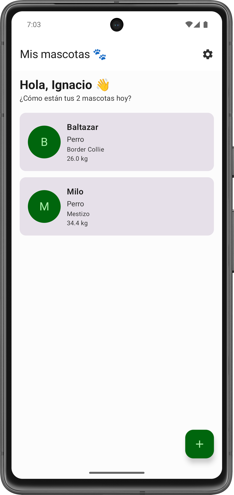
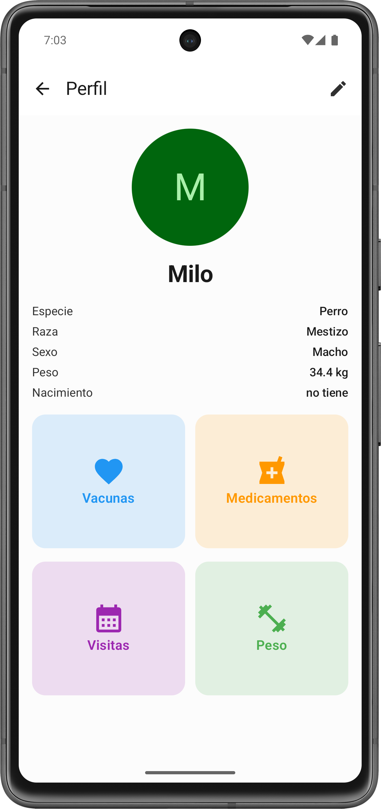
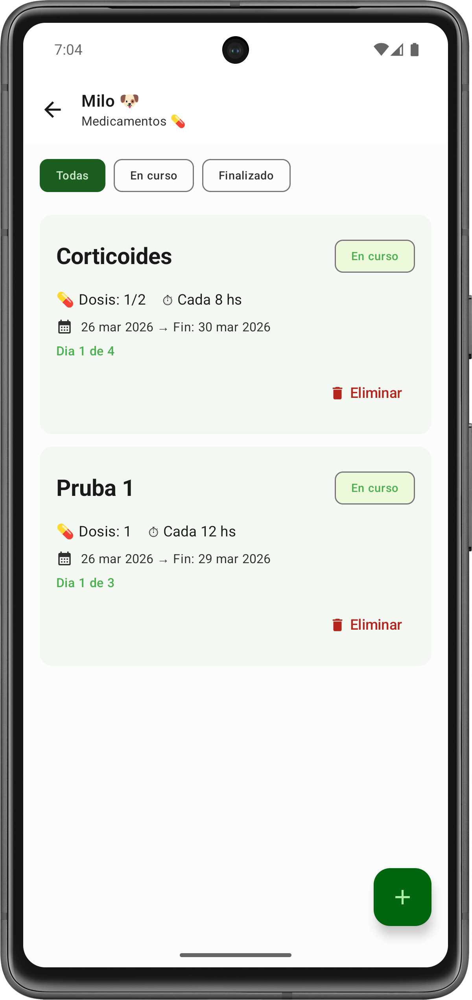
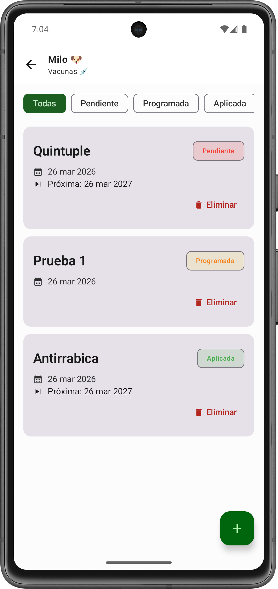
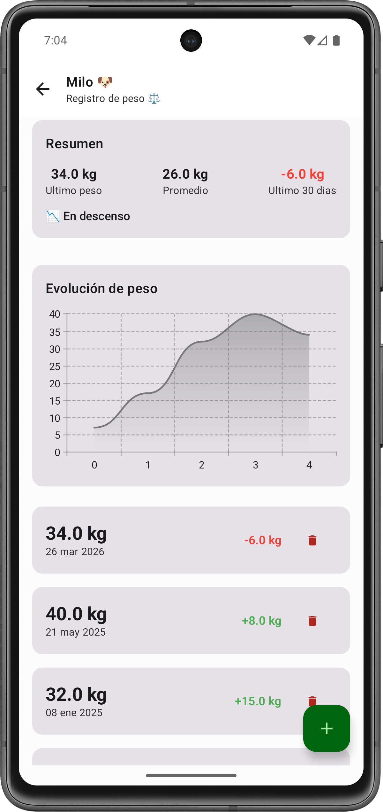

# PawCare 🐾

> La libreta veterinaria de tu mascota, siempre en tu bolsillo.

App Android para gestionar la salud de tus mascotas — vacunas, medicamentos, visitas veterinarias y registro de peso, todo en un solo lugar.

---

## Screenshots

<p align="center">
  
  
  
  
  
</p>

---

## Features

- 🐶 **Perfil de mascotas** — foto, raza, sexo, fecha de nacimiento
- 💉 **Vacunas** — historial, estados, próxima dosis automática para vacunas anuales
- 💊 **Medicamentos** — dosis, intervalo, progreso del tratamiento
- 📅 **Visitas veterinarias** — turnos con estado y recordatorios
- ⚖️ **Registro de peso** — historial con gráfica de evolución y métricas
- 🔔 **Notificaciones** — recordatorios automáticos aunque la app esté cerrada
- ⚙️ **Settings** — perfil del usuario y datos del veterinario

---

## Stack técnico

| Categoría | Tecnología |
|-----------|-----------|
| Lenguaje | Kotlin |
| UI | Jetpack Compose + Material 3 |
| Arquitectura | Clean Architecture + MVVM |
| Base de datos | Room |
| Async | Coroutines + Flow + StateFlow |
| DI | Hilt |
| Navegación | Navigation Compose |
| Notificaciones | WorkManager |
| Imágenes | Coil |
| Gráficas | Vico |
| Preferencias | DataStore |

---

## Arquitectura
```
app/
├── data/
│   ├── local/          → Room, DAOs, Entities, Workers
│   └── repository/     → Repositorios
├── domain/
│   └── model/          → Modelos puros, sin dependencias de Android
├── presentation/
│   ├── pets/           → Pantallas y ViewModels de mascotas
│   ├── vaccines/       → Pantallas y ViewModels de vacunas
│   ├── medications/    → Pantallas y ViewModels de medicamentos
│   ├── appointments/   → Pantallas y ViewModels de visitas
│   ├── weight/         → Pantallas y ViewModels de peso
│   ├── settings/       → Configuración
│   └── components/     → Componentes reutilizables
└── di/                 → Módulos de Hilt
```

**Flujo de datos:**
```
Room → Repository → ViewModel → UI
         (Flow)     (StateFlow)
```

---

## Cómo correr el proyecto

1. Cloná el repositorio
```bash
git clone https://github.com/tuUsuario/pawcare-android.git
```

2. Abrí el proyecto en Android Studio
3. Sincronizá las dependencias con Gradle
4. Corré la app en un emulador o dispositivo físico (API 26+)

---

## Estado del proyecto

🚧 En desarrollo activo — v1.1

### Próximamente
- [ ] Historial clínico completo
- [ ] ID único por mascota con QR
- [ ] Exportar historial en PDF
- [ ] Sincronización en la nube

---

## Autor

**Ignacio Herner**
Android Developer en formación
[LinkedIn](https://www.linkedin.com/in/ignacioherner/) · [GitHub](https://github.com/IgnacioHerner)